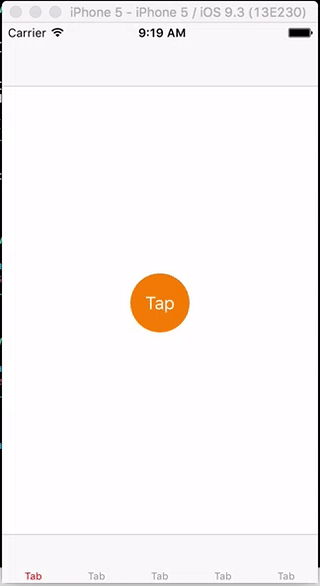

# YFPopupButtons

[](https://travis-ci.org/pushian/YFPopupButtons)
[](http://cocoapods.org/pods/YFPopupButtons)
[](http://cocoapods.org/pods/YFPopupButtons)
[](http://cocoapods.org/pods/YFPopupButtons)



## Example

To run the example project, clone the repo, and run `pod install` from the Example directory first.

## Installation

YFPopupButtons is available through [CocoaPods](http://cocoapods.org). To install
it, simply add the following line to your Podfile:

```ruby
pod "YFPopupButtons"
```

##How To Use

###Initialization
```swift
var testView = YFPopupButtonsView()
testView.delegate = self
```
###Core Functions
- Display the button view and pop up the buttons.
```swift
testView.show()
```
- Dismiss the button view and the buttons. Normally, the user does not have to call this function in their own code because there are alreay built in dismiss actions in the view.
```swift
testView.dismiss()
```

###Delegate Functions
- Indicate the total number of buttons.
```swift
func numOfItems(buttonsView: YFPopupButtonsView) -> Int
```
- Indicate the maximum number of buttons allowed for display in a single row.
```swift
func maxNumberOfItemsInRow(buttonsView: YFPopupButtonsView) -> Int
```
- Define the size for all the buttons.
```swift
func itemSize(buttonsView: YFPopupButtonsView) -> CGSize
```
- Initialize and customize the buttons.
```swift
func buttonsView(buttonsView: YFPopupButtonsView, itemForIndex index: Int) -> YFPopupbotton
```
> Example of Defining Round Buttons with Image and Title.

```swift
func buttonsView(buttonsView: YFPopupButtonsView, itemForIndex index: Int) -> YFPopupbotton {
    let button = YFPopupbotton(contentImage: UIImage(named: "fbIcon")!, title: "Title")
    button.contentImageView.layer.cornerRadius = 30
    button.contentImageView.backgroundColor = .whiteColor()
    button.contentImageView.contentMode = .ScaleAspectFill
    return button
}
```
- Customize the actions triggered by clicking a certain button.
```swift
func buttonsView(buttonsView: YFPopupButtonsView, didTapItemAtIndex index: Int)
```
- Define the space left between the left-most button/right-most button and the view.
```swift
func sideMargin(buttonsView: YFPopupButtonsView) -> CGFloat
```
- Define the sapce between two rows of the buttons
```swift
func spaceBetweenRows(buttonsView: YFPopupButtonsView) -> CGFloat
```
- Customize the actions triggered before the display of the buttons.
```swift
func buttonsViewWillAppear(buttonsView: YFPopupButtonsView)
```
- Customize the actions triggered after the buttons being dismissed.
```swift
func buttonsViewWillDisappear(buttonsView: YFPopupButtonsView)
```
## Author

pushian, l@fooyo.sg

## License

YFPopupButtons is available under the MIT license. See the LICENSE file for more info.
